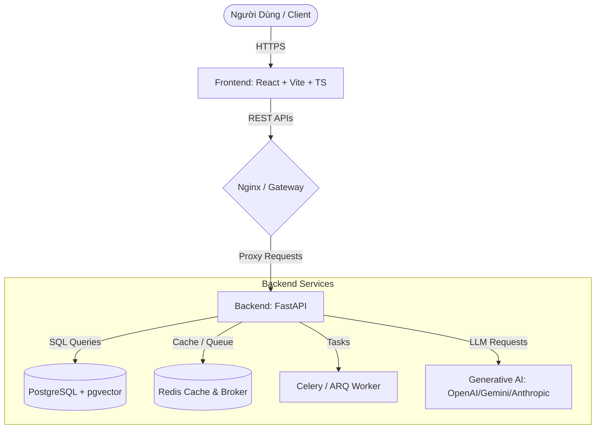
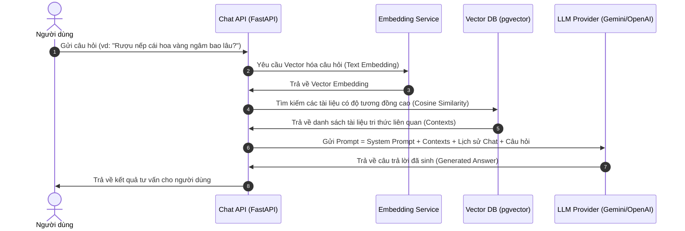

# Tài Liệu Kiến Trúc Hệ Thống - Lò Rượu Cậu Hai

Tài liệu này mô tả chi tiết kiến trúc tổng thể, các thành phần hệ thống và luồng dữ liệu của dự án Lò Rượu Cậu Hai.

---

## 1. Tổng Quan Kiến Trúc (Architecture Overview)

Hệ thống được thiết kế theo mô hình Monorepo chứa cả Frontend và Backend, tách biệt hoàn toàn giữa giao diện người dùng và nghiệp vụ hệ thống.



---

## 2. Kiến Trúc Backend (Backend Layered Architecture)

Backend được xây dựng bằng **FastAPI** và tuân thủ mô hình kiến trúc phân lớp (Layered Architecture):

```text
Client ──► Router (api/) ──► Service (services/) ──► Repository (repositories/) ──► Database
```

### Các Lớp Nghiệp Vụ chính:
*   **Router (Tầng giao tiếp - `app/api`):** Định nghĩa các endpoints RESTful, nhận request, kiểm tra định dạng dữ liệu đầu vào bằng Pydantic Schemas, gọi tới lớp Service tương ứng và định dạng response trả về cho Client.
*   **Service (Tầng nghiệp vụ - `app/services`):** Nơi xử lý toàn bộ logic nghiệp vụ (Business Logic). Nó điều phối các truy cập cơ sở dữ liệu qua Repository, tích hợp với Module AI và tích hợp API của bên thứ ba.
*   **Repository (Tầng truy xuất dữ liệu - `app/repositories`):** Chứa các câu lệnh SQL sử dụng SQLAlchemy ORM 2.0 để thực hiện các thao tác CRUD với Database. Không được chứa logic nghiệp vụ tại đây.
*   **Models & Schemas (`app/models`, `app/schemas`):** 
    *   `models/`: Khai báo cấu trúc bảng cơ sở dữ liệu (SQLAlchemy Models).
    *   `schemas/`: Khai báo cấu trúc validate dữ liệu đầu vào/đầu ra (Pydantic Models).

---

## 3. Kiến Trúc AI (GenAI & RAG Flow)

Hệ thống tích hợp Trợ lý AI thông minh để tư vấn về các loại rượu, quy trình chưng cất, hướng dẫn sử dụng và hỗ trợ mua hàng. Trợ lý AI sử dụng phương pháp **RAG (Retrieval-Augmented Generation)** để truy vấn thông tin chính xác từ kho tri thức nội bộ.

### Sơ đồ Luồng RAG:



---

## 4. Tác Tử Thông Minh (Agentic Workflow)

Khi người dùng yêu cầu các hành động phức tạp hơn (ví dụ: kiểm tra đơn hàng, đặt mua rượu tự động hoặc phân tích doanh số):

```text
User ──► Agent (FastAPI) ──► Planner (LLM) ──► Tool Calling ──► DB/External API ──► Final Answer
```

*   **Planner (LLM):** Đóng vai trò bộ não quyết định xem để hoàn thành yêu cầu cần thực hiện những bước nào và cần sử dụng công cụ (Tool) nào.
*   **Tool Calling (`app/ai/tools.py`):** Các hàm Python được định nghĩa sẵn và khai báo cho LLM sử dụng (ví dụ: `get_order_status`, `create_draft_order`, `check_product_inventory`).
*   **Execution:** Thực thi công cụ để lấy kết quả thời gian thực, đưa lại vào ngữ cảnh LLM để tổng hợp câu trả lời cuối cùng cho người dùng.
